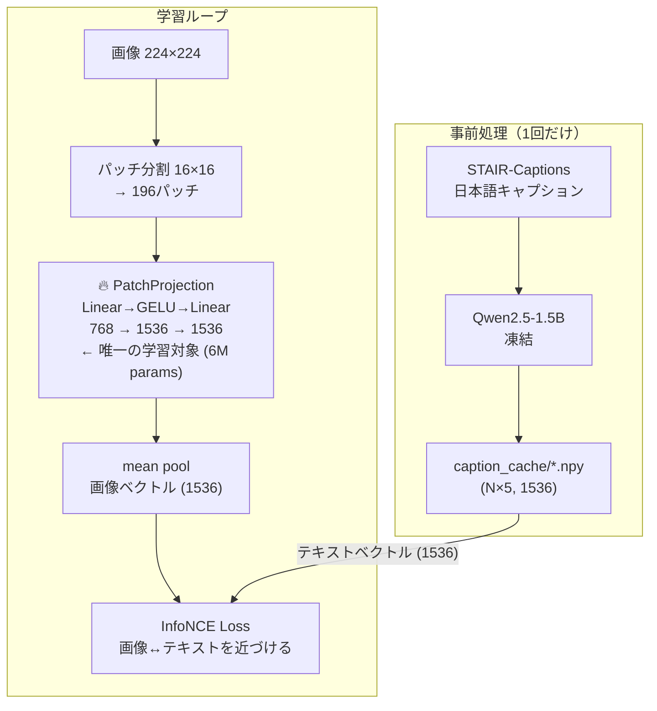
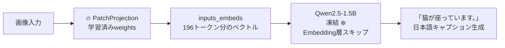
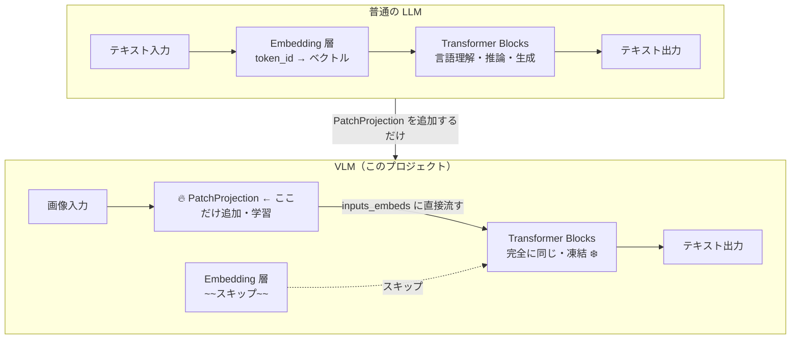

# Japanese VLM — LLaVA-style Vision-Language Model

日本語キャプションデータセット（STAIR-Captions）を用いて、  
既存LLM（Qwen2.5）に視覚理解能力を付与する軽量VLMプロジェクト。

---

## アーキテクチャ概要

### 学習フェーズ



### 推論フェーズ



### LLM と VLM の差分



---

## 設計思想

### なぜこの構造か

LLM（Qwen）はすでに日本語の「脳」として完成されている。  
必要なのは画像を「Qwenが理解できる言語空間のベクトル」に変換する**目**だけ。

```
画像パッチ (768次元)
    ↓  PatchProjection（学習）
Qwen埋め込み空間 (1536次元)
    ↓  Qwen Transformer（凍結・触らない）
日本語テキスト生成
```

学習パラメータを最小限（6M）に抑えることで、  
**RTX 4060 Ti 16GB** という一般的なGPUで現実的な時間で学習できる。

---

## 高速化：キャプションキャッシュ

### 問題

毎ステップQwen（1.5B）のforward passを実行すると1epoch≈90分かかる。

### 解決策

```
事前処理（1回だけ）:
  全キャプション → Qwen → ベクトル → caption_cache/*.npy に保存

学習時:
  キャッシュから読むだけ → Qwen不要 → 1epoch≈5〜10分
```

| | キャッシュなし | キャッシュあり |
|---|---|---|
| 1epoch時間 | ≈ 90分 | ≈ 5〜10分 |
| 学習時VRAM | Qwen+Proj | PatchProjectionのみ |
| キャッシュサイズ | - | ≈ 1GB |

---

## データセット

**STAIR-Captions** (`shunk031/STAIR-Captions`)

- MS-COCOの画像に日本語キャプションを付与したデータセット
- 画像1枚につき5つのキャプション
- train: 82,783枚 / validation: 40,504枚

学習時は5つのキャプションからランダムに1つ選択（データ拡張）。

---

## ファイル構成

```
vlm_project/
├── config.py              # ハイパーパラメータ
├── model.py               # PatchProjection / LLaVAModel
├── dataset.py             # データローダー（キャッシュ対応）
├── train.py               # 学習ループ
├── cache_embeddings.py    # キャプション事前ベクトル化
├── caption_cache/
│   ├── train.npy          # (414,915, 1536) float32
│   └── validation.npy     # (202,520, 1536) float32
└── checkpoints/
    ├── best.pt            # 最良モデル（PatchProjectionのみ）
    └── epoch_N.pt
```

---

## セットアップ

```bash
conda create -n vlm python=3.11 -y
conda activate vlm
pip install torch torchvision torchaudio --index-url https://download.pytorch.org/whl/cu121
pip install transformers datasets accelerate pillow tqdm bitsandbytes
```
- cudaが搭載せれてないマシンの場合torch部分の変更有
---

## 実行方法

### 1. キャプションキャッシュの作成（1回だけ）

```bash
python cache_embeddings.py
```

Qwen2.5-1.5Bで全キャプションをベクトル化して保存する。  
約30〜60分かかるが**1回だけ**実行すればよい。

### 2. 学習

```bash
python train.py
```

### 3. 推論

```python
import torch
from model import LLaVAModel, get_tokenizer
from config import Config
from torchvision import transforms
from PIL import Image

config    = Config()
tokenizer = get_tokenizer(config)

# 学習済みPatchProjectionを読み込んでQwenに接続
ckpt  = torch.load("checkpoints/best.pt")
model = LLaVAModel(config, patch_proj_state_dict=ckpt["patch_proj"])
model = model.to("cuda")

# 画像を読み込んでキャプション生成
transform = transforms.Compose([
    transforms.Resize(224),
    transforms.CenterCrop(224),
    transforms.ToTensor(),
    transforms.Normalize([0.485,0.456,0.406],[0.229,0.224,0.225]),
])
image   = transform(Image.open("test.jpg")).to("cuda")
caption = model.generate(image, tokenizer=tokenizer)
print(caption)
# → "公園で犬が走っています。"
```

---

## ハイパーパラメータ

| パラメータ | 値 | 説明 |
|---|---|---|
| text_model_name | Qwen/Qwen2.5-1.5B | テキストエンコーダー（凍結） |
| image_size | 224 | 入力画像サイズ |
| patch_size | 16 | パッチサイズ（196パッチ） |
| embed_dim | 1536 | Qwen hidden size |
| batch_size | 4 | ミニバッチサイズ |
| grad_accum_steps | 8 | 実効バッチサイズ = 32 |
| lr | 1e-4 | 学習率 |
| temperature | 0.07 | InfoNCE温度パラメータ |
| epochs | 3〜10 | 学習エポック数 |

---
データセットを変える場合の変更箇所
config.py（1行）
pythondataset_name: str = "別のデータセット名"
dataset.py（変更が必要な可能性がある箇所）
python# ① データセットのバージョン指定（データセットによって不要な場合も）
self.data = load_dataset(
    config.dataset_name,
    "v1.2.0",      # ← ここをデータセットに合わせる or 削除
    split=split,
)

## ② キャプションのフィールド名
captions = item.get("captions")  ← フィールド名がデータセットによって違う
"caption" / "text" / "description" など

---

## 動作環境

| 項目 | 要件 |
|---|---|
| OS | Windows 11 |
| GPU | NVIDIA RTX 4060 Ti 16GB |
| CUDA | 12.1 |
| Python | 3.11 |
| PyTorch | 2.x |

---

## 今後の拡張

- [ ] Qwen3-9B（4bit量子化）への差し替え → `config.py`の1行変更で対応
- [ ] Bonsai-8B（1bit）への差し替え → llama-cpp-python対応後
- [ ] データ追加（`mmnga/llava-pretrain-ja`等の日本語VLMデータ）
- [ ] LLaVA-1.5式の完全fine-tune（Qwenの一部層も学習対象に）